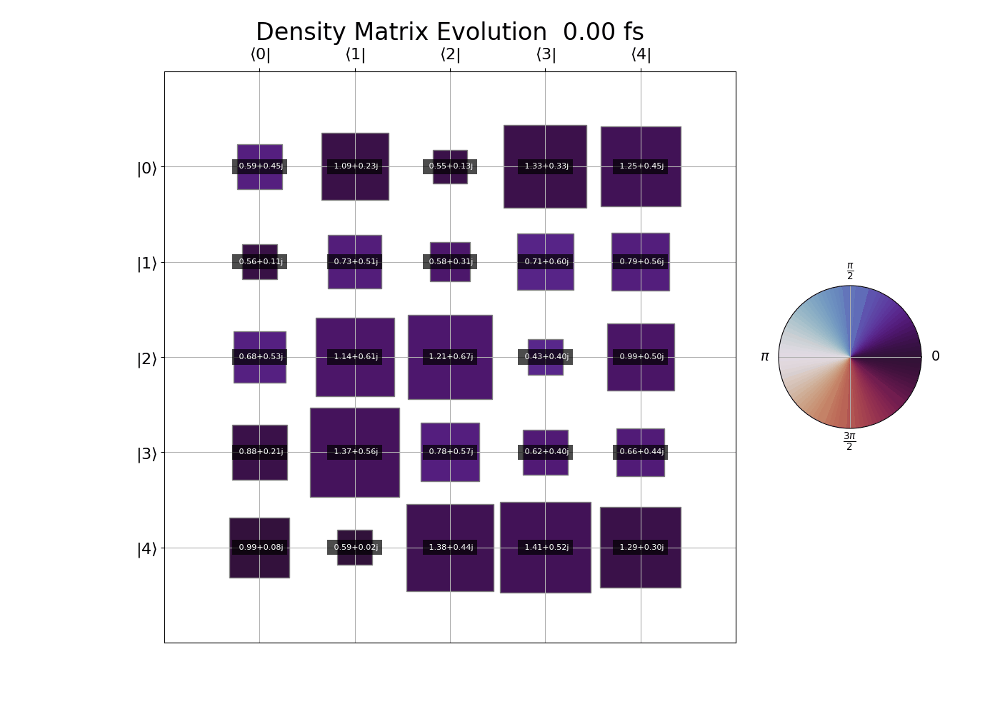

# anim-complex-matrix
Animation for complex matrix elements (such as time-dependent density matrix)


## Requirements
Only `numpy` and `matplotlib`

## Usage
```python
>>> import numpy as np
>>> from main import get_anim
>>> time = np.load("time.npy")
>>> data = np.load("data.npy")
>>> print(f"{data.shape=}, {time.shape=}, {data.dtype=}, {time.dtype=}")
data.shape=(20, 5, 5), time.shape=(20,), data.dtype=dtype('complex128'), time.dtype=dtype('float64')
>>> size = data.shape[1]
>>> fig, anim = get_anim(
>>>     data,
>>>     time=time,
>>>     title="Density Matrix Evolution",
>>>     save_gif=True,
>>>     gif_filename="complex_matrix.gif",
>>>     cmap="twilight_shifted",
>>>     time_unit="fs",
>>>     row_names=["$|" + f"{i}" + r"\rangle$" for i in range(size)],
>>>     col_names=[r"$\langle" + f"{i}" + r"|$" for i in range(size)],
>>>     fps=5,
>>>     dpi=100,
>>> )
Saving animation to complex_matrix.gif...
Animation saved successfully!
>>> plt.show()
```

